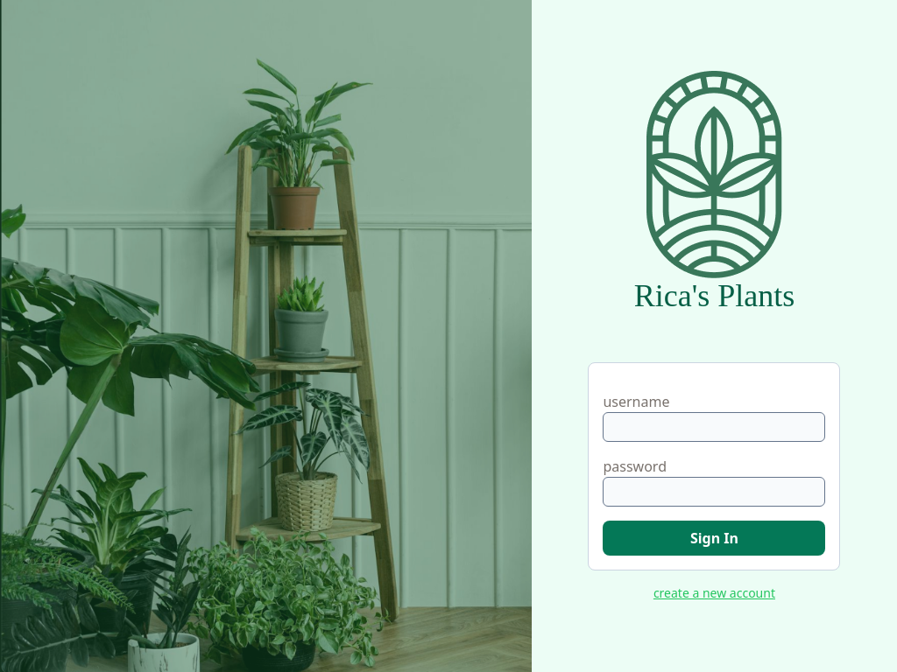
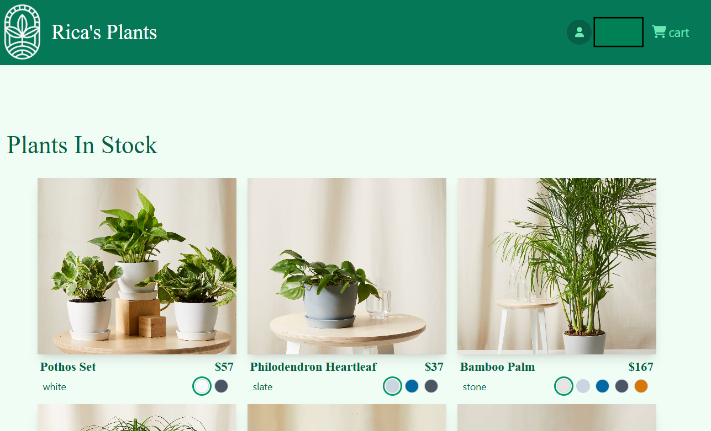

# React Formula Capstone

This was the capstone project from React Formula. I used this course to build my React skills and get more hands-on knowledge of the language. 
React was something I struggled to self-teach until I found this course. By the end of it, I was completing entire modules my way without the help of walkthroughs or hints. 
This course included the use of several modules as well. Please enjoy using this mock web store.

I have www.React-Formula.com to thank for this project.

## Tools used
- React
- Vite
- Tailwind CSS
- clsx
- Motion Framer
- and more.

## What I learned
I was able to reinforce my understanding of Hooks and components. My code was clean and I was able to create components wisely.

## Future Developments
I intend on building my backend skills and hosting my own database soon. Right now, this is a frontend-only project with the course instructor hosting the data.

## Disclaimer
This app requires a valid API key. React-Formula provides me with one that lasts ~ 5 days. I will refresh my key for some time while people view my work after it is posted. Reach out to me if it is invalid and you would like to see the app in full. My React-Formula subscription expires in August 2025.
